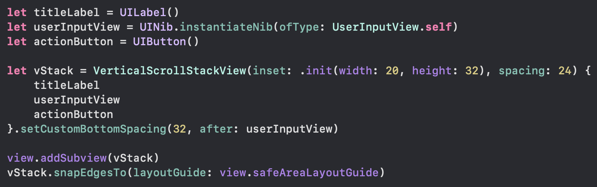

# VerticalScrollStackView
A SwiftUI-like syntax composition for UIKit. A view embedding scrollView embedding a self expanding stackView. A compossible skeleton for main view of UIViewController.

## Description
Developed with @resultBuilders, underlying tech of SwiftUI.
This wrapper embeds a scrollView, contentView and a vertical stackView inside it. So redundant setup is reduced.
All you have to do is pass subviews(even ones created from Xib) inside the initializer of this wrapper and it will give you everything stitched.

### Advantages are:
* No Xib needed for the skeleton.
* Highly compossible since there can be if/else conditions added here.
* Redundant code & effort for creating scrollViews and main stackView is removed.
* No tableView boilerplate code & management needed for simpler view with 5-10 subviews.
* Comfortably create components in Xib and stitch them with this wrapper.
* On showing & hiding subviews, the stackView will automatically shrink.
* Easier to give custom spacing between subviews using modifiers.

## Usage

## Installation
Drag VerticalScrollStackView.swift file into your project. That's it!
